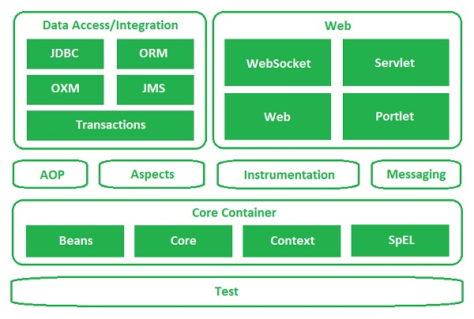
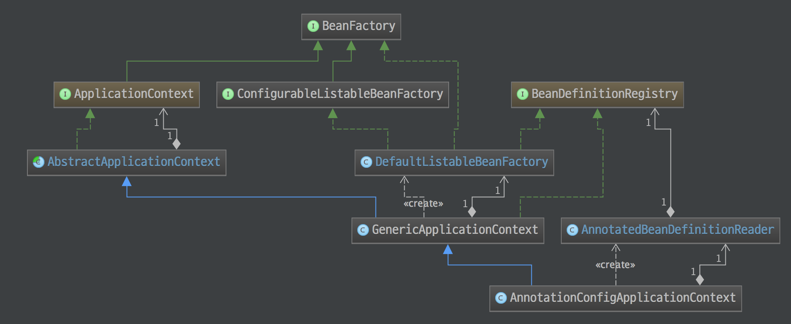
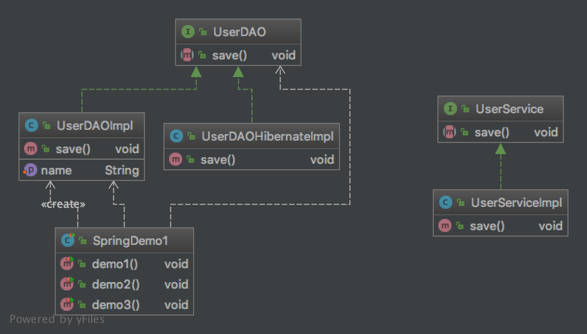

## 第1章 Spring_day01 笔记

### 1.1 上次课内容回顾

#### 1.1.1 `Struts2` 的拦截器

##### 1.1.1.1 Struts2 的拦截器概念

​	拦截器：拦截对 `Action` 的访问，拦截到 `Action` 的具体的方法。

##### 1.1.1.2 Struts2 的执行流程

​	请求--->核心过滤器-->创建 `ActionProxy`，调用 `proxy.execute` 方法。在这个内部-->`ActionInvocation.invoke()` 在这个方法内部，递归执行一组拦截器-->`Action`-->`Result`-->拦截器后面的代码

##### 1.1.1.3 Struts2 的拦截器

##### 1.1.2 `CRM` 的登录案例：

​	权限拦截器

#### 1.2 `Struts2` 的标签库

##### 1.2.1 通用标签

​	`if、elseif、else、iterator、property、date、debug`

##### 1.2.2 `UI` 标签（数据回显）

​	表单标签

### 1.2 Spring4 学习路线

`Spring` 第一天：`Spring` 的概述、`SpringIOC` 入门（`XML`）、`Spring` 的 `Bean` 管理、`Spring` 属性注入

`Spring` 第二天：`Spring` 的 `IOC` 的注解方式、`Spring` 的 `AOP` 开发（`XML`）

`Spring` 第三天：`Spring` 的 `AOP` 的注解开发、`Spring` 的声明式事务、`JdbcTemplate`。

`Spring` 第四天：`SSH` 的整合、`HibernateTemplate` 的使用、`OpenSessionInViewFilter` 的使用。

### 1.3 Spring 的概述

#### 1.3.1 `Spring` 的概述

##### 1.3.1.1 什么是 `Spring`

​	Spring Framework 是一个开源的 `Java/Java EE` 全功能栈（full-stack）的应用程序框架，以`Apache License 2.0` 开源许可协议的形式发布，也有 `.NET` 平台上的移植版本。该框架基于 `Expert One-on-One Java EE Design and Development（ISBN 0-7645-4385-7）`一书中的代码，最初由 `Rod Johnson` 和 `Juergen Hoeller` 等开发。`Spring Framework` 提供了一个简易的开发方式，这种开发方式，将避免那些可能致使底层代码变得繁杂混乱的大量的属性文件和帮助类。

###### `Spring`：`SE/EE` 开发的**一站式**框架。

一站式框架：有 EE 开发的每一层解决方案。

- `Web` 层		：`SpringMVC`
	 `Service` 层	：`Spring` 的 `Bean` 管理，`Spring` 声明式事务
	 `DAO` 层		：`Spring` 的 `JDBC` 模板，`Spring` 的 `ORM` 模块

##### 1.3.1.2 为什么学习 Spring

1. 强大的基于 `JavaBeans` 的采用控制反转（`Inversion of Control，IoC`）原则的配置管理，使得应用程序的组建更加快捷简易。
2. 一个可用于 `Java EE` 等运行环境的核心 `Bean` 工厂。
3. 数据库事务的一般化抽象层，允许声明式（`Declarative`）事务管理器，简化事务的划分使之与底层无关。
4. 内建的针对 `JTA` 和单个 `JDBC` 数据源的一般化策略，使 `Spring` 的事务支持不要求 `Java EE` 环境，这与一般的 `JTA` 或者 `EJB CMT` 相反。
5. `JDBC` 抽象层提供了有针对性的异常等级（不再从 `SQL` 异常中提取原始代码），简化了错误处理，大大减少了程序员的编码量。再次利用 `JDBC` 时，你无需再写出另一个「终止」（`finally`）模块。并且面向 `JDBC` 的异常与 `Spring` 通用数据访问对象（`Data Access Object`）异常等级相一致。
6. 以资源容器，`DAO` 实现和事务策略等形式与 `Hibernate`，`JDO` 和 `MyBatis`、`SQL Maps` 集成。利用众多的翻转控制方便特性来全面支持，解决了许多典型的 `Hibernate` 集成问题。所有这些全部遵从 `Spring` 通用事务处理和通用数据访问对象异常等级规范。
7. 灵活的基于核心 `Spring` 功能的 `MVC` 网页应用程序框架。开发者通过策略接口将拥有对该框架的高度控制，因而该框架将适应于多种呈现（`View`）技术，例如 `JSP、FreeMarker、Velocity、Thymeleaf` 等。值得注意的是，`Spring` 中间层可以轻易地结合于任何基于 `MVC` 框架的网页层，例如 `Struts、WebWork` 或 `Tapestry`。
8. 提供诸如事务管理等服务的 `AOP` 框架。

##### 1.3.1.3 `Spring` 的版本

​	Spring3.x 和 Spring4.x

#### 1.3.2 Spring 的入门（IOC）

##### 1.3.2.1 什么 `IOC`

###### `IOC: Inversion of Control`(控制反转)。

​	控制反转：将对象的创建权反转给（交给）`Spring`。

##### 1.3.2.2 下载 Spring 的开发包

​	官网：http://spring.io/

##### 1.3.2.3 解压 `Spring` 的开发包

 docs	：Spring 的开发规范和 API
 libs		：Spring 的开发的 jar 和源码
 schema	：Spring 的配置文件的约束

##### 1.3.2.4 创建 `Web` 项目，引入 `jar` 包



```powershell
.
├── .DS_Store
├── WEB-INF
│   ├── lib
│   │   ├── com.springsource.org.apache.commons.logging-1.1.1.jar
│   │   ├── com.springsource.org.apache.log4j-1.2.15.jar
│   │   ├── spring-beans-4.2.4.RELEASE.jar
│   │   ├── spring-context-4.2.4.RELEASE.jar
│   │   ├── spring-core-4.2.4.RELEASE.jar
│   │   └── spring-expression-4.2.4.RELEASE.jar
│   └── web.xml
└── index.jsp
```

##### 1.3.2.5 创建接口和类

```java
public interface UserService {
    public void save();
}
```

```java
public class UserDAOImpl implements UserDAO {
    private String name;

    public void setName(String name) {
        this.name = name;
    }

    @Override
    public void save() {
        System.out.println("UserDAOImpl执行了..." + name);
    }
}
```

###### 问题：

如果底层的实现切换了，需要修改源代码，能不能不修改程序源代码对程序进行扩展？

##### 1.3.2.6 将实现类交给 Spring 管理

​	在 `Spring` 的解压路径下 `spring-framework-4.2.4.RELEASE\docs\spring-framework-reference\html\xsd-configuration.html`

```xml
<?xml version="1.0" encoding="UTF-8"?>
<beans
        xmlns="http://www.springframework.org/schema/beans"
        xmlns:xsi="http://www.w3.org/2001/XMLSchema-instance"
        xsi:schemaLocation="
        http://www.springframework.org/schema/beans
        http://www.springframework.org/schema/beans/spring-beans.xsd">
    <!--Spring 入门配置-->
    <bean id="userDAO" class="com.lightwing.spring.demo1.UserDAOImpl"/>
</beans>
```

##### 1.3.2.7 编写测试类

```java
@Test
public void demo2() {
    // 创建 Spring 的工厂
    ApplicationContext applicationContext = new ClassPathXmlApplicationContext("applicationContext.xml");
    UserDAO userDAO = (UserDAO) applicationContext.getBean("userDAO");
    userDAO.save();
}
```

##### 1.3.2.8 `IOC` 和 `DI`（*****）

###### `IOC`：控制反转，将对象的创建权反转给了Spring。

`DI`：依赖注入，前提必须有 `IOC` 的环境，Spring 管理这个类的时候将类的依赖的属性注入（设置）进来。

###### 面向对象的时候

依赖

```java
Class A {
}

Class B {
    public void xxx(A a) { // 方法中需要 A
    }
}
```

继承: `is a` **麻雀**是一只**鸟**。

```java
Class A {
}

Class B extends A {
}
```

聚合: has a **阿根廷队**有**梅西**。

```java
A a;
a.setPlayer("Messi");
```

### 1.4 Spring 的工厂类

#### 1.4.1 Spring的工厂类

##### 1.4.1.1 Spring 工厂类的结构图



`ApplicationContext` 继承 `BeanFactory`。

##### 1.4.1.2 `BeanFactory`: 老版本的工厂类

`BeanFactory`：调用 `getBean` 的时候，才会生成类的实例。

##### 1.4.1.3 `ApplicationContext`: 新版本的工厂类

`ApplicationContext`：加载配置文件的时候，就会将 Spring 管理的类都实例化。
`ApplicationContext` 有两个实现类

- `ClassPathXmlApplicationContext`：加载类路径下的配置文件
- `FileSystemXmlApplicationContext`：加载文件系统下的配置文件

### 1.5 Spring 的配置

#### 1.5.1 XML 的提示配置

##### 1.5.1.1 Schema 的配置

#### 1.5.2 Bean 的相关的配置

##### 1.5.2.1 `<bean>` 标签的 id 和 name 的配置

- `id`: 使用了约束中的唯一约束。里面不能出现特殊字符的。

- `name`: 没有使用约束中的唯一约束（理论上可以出现重复的，但是实际开发不能出现的）。里面可以出现特殊字符。
  - `Spring` 和 `Struts1` 框架整合的时候
  - `<bean name="/user" class=""/>`

##### 1.5.2.2 `Bean` 的生命周期的配置（了解）



- `init-method`: `Bean` 被初始化的时候执行的方法

- `destroy-method`: `Bean` 被销毁的时候执行的方法（`Bean` 是**单例创建，工厂关闭**）

```java
    @Test
    public void demo1() {
        ClassPathXmlApplicationContext applicationContext = new ClassPathXmlApplicationContext
                ("applicationContext.xml");
        CustomerDAO customerDAO = (CustomerDAO) applicationContext.getBean("customerDAO");
        customerDAO.save();
        applicationContext.close();
    }
```

##### 1.5.2.3 `Bean` 的作用范围的配置（重点）

###### scope | Bean的作用范围

-  `singleton` | 默认的，Spring 会采用单例模式创建这个对象。
-  `prototype` | 多例模式。（`Struts2` 和 `Spring` 整合一定会用到）
-  `request` | 应用在 Web 项目中，Spring 创建这个类以后，将这个类存入到 request 范围中。
-  `session` | 应用在 Web 项目中，Spring 创建这个类以后，将这个类存入到 session 范围中。
-  `globalsession` | 应用在 Web 项目中，必须在 porlet 环境下使用。但是如果没有这种环境，相对于 session。

```java
    // Bean 的作用范围配置
    @Test
    public void demo2() {
        ClassPathXmlApplicationContext applicationContext = new ClassPathXmlApplicationContext("applicationContext.xml");
        CustomerDAO customerDAO1 = (CustomerDAO) applicationContext.getBean("customerDAO");
        System.out.println(customerDAO1);
        CustomerDAO customerDAO2 = (CustomerDAO) applicationContext.getBean("customerDAO");
        System.out.println(customerDAO2);
        System.out.println(customerDAO1 == customerDAO2);
        applicationContext.close();
    }
```

### 1.6 `Spring` 的 `Bean` 管理（XML方式）

#### 1.6.1 Spring 的 Bean 的实例化方式（了解）

`Bean` 已经都交给 `Spring` 管理，`Spring` 创建这些类的时候，有几种方式：

##### 1.6.1.1 无参构造方法的方式（默认）

###### 1. 编写类

```java
public class Bean1 {
    public Bean1() {
        super();
        System.out.println("Bean1: Constructor without parameters");
    }
}
```

###### 2. 编写配置

```xml
<bean id="bean1" class="com.lightwing.spring.demo3.Bean1"/>
```

##### 1.6.1.2 静态工厂实例化的方式

###### 1. 编写 `Bean2` 的静态工厂

```java
/**
 * Bean2的静态工厂
 *
 * @author Lightwing Ng
 */
public class Bean2Factory {
	public static Bean2 createBean2(){
		System.out.println("Bean2Factory is executed");
		return new Bean2();
	}
}
```

###### 2. 配置

```xml
<bean id="bean2Factory" class="com.lightwing.spring.demo3.Bean2Factory"
          factory-method="createBean2"/>
<bean id="bean2" class="com.lightwing.spring.demo3.Bean2"/>
```

##### 1.6.1.3 实例工厂实例化的方式

###### 1. `Bean3` 的实例工厂

```java
/**
 * Bean3 的实例工厂
 *
 * @author Lightwing Ng
 */
public class Bean3Factory {
    public Bean3 createBean3() {
        System.out.println("Bean3Factory is executed");
        return new Bean3();
    }
}
```

###### 2. 配置

```xml
<bean id="bean3Factory" class="com.lightwing.spring.demo3.Bean3Factory"/>
<bean id="bean3" factory-bean="bean3Factory" factory-method="createBean3"/>
```

#### 1.6.2 `Spring` 的属性注入

##### 1.6.2.1 构造方法的方式的属性注入

###### 构造方法的属性注入

```xml
<bean id="car" class="com.lightwing.spring.demo4.Car">
	<constructor-arg name="name" value="Phaeton"/>
	<constructor-arg name="price" value="1000000"/>
</bean>
```

#### 1.6.2.2 `Set` 方法的方式的属性注入

###### 1. `Set` 方法的属性注入

```xml
<bean id="car2" class="com.lightwing.spring.demo4.Car2">
	<property name="name" value="Phaeton 4.2"/>
	<property name="price" value="2000000"/>
</bean>
```

###### 2. `Set` 方法设置对象类型的属性

```xml
<bean id="emplyee" class="com.lightwing.spring.demo4.Employee">
	<property name="name" value="Zhong Xiaodi"/>
	<property name="car2" ref="car2"/>
</bean>
```

##### 1.6.2.3 P 名称空间的属性注入（`Spring2.5` 以后）

###### 通过引入 P 名称空间完成属性的注入：

写法：

- 普通属性	p:属性名="值"
-  对象属性	p:属性名-ref="值"

###### P名称空间的引入

```xml
xmlns:p="http://www.springframework.org/schema/p"
```

###### 使用 P 名称空间

```xml
<bean id="car2" class="com.lightwing.spring.demo4.Car2" p:name="Phaeton 4.2" p:price="2000000"/>
<bean id="emplyee" class="com.lightwing.spring.demo4.Employee" p:name="Tang Yuheng"
          p:car2-ref="car2"/>
```

##### 1.6.2.4 `SpEL` 的属性注入（Spring3.0以后）

###### `SpEL: Spring Expression Language, Spring` 的表达式语言。

语法：`#{SpEL}`

#### 1.6.3 集合类型属性注入(了解)

##### 1.6.3.1 配置     		

```xml
    <bean id="collectionBean" class="com.lightwing.spring.demo5.CollectionBean">
        <!-- 数组类型 -->
        <property name="arrs">
            <list>
                <value>王东</value>
                <value>赵洪</value>
                <value>李冠希</value>
            </list>
        </property>

        <!-- 注入list集合 -->
        <property name="list">
            <list>
                <value>李兵</value>
                <value>赵如何</value>
                <value>邓凤</value>
            </list>
        </property>

        <!-- 注入set集合 -->
        <property name="set">
            <set>
                <value>aaa</value>
                <value>bbb</value>
                <value>ccc</value>
            </set>
        </property>

        <!-- 注入Map集合 -->
        <property name="map">
            <map>
                <entry key="aaa" value="111"/>
                <entry key="bbb" value="222"/>
                <entry key="ccc" value="333"/>
            </map>
        </property>
    </bean>
```
### 1.7 Spring 的分模块开发的配置

#### 1.7.1 分模块配置

##### 1.7.1.1 在加载配置文件的时候，加载多个

```java
ApplicationContext applicationContext = new ClassPathXmlApplicationContext("applicationContext.xml");
```

##### 1.7.1.2 在一个配置文件中引入多个配置文件

```xml
<import resource="applicationContext2.xml">
```

### 1.8 `CRM` 的综合案例

#### 1.8.1 代码实现

##### 1.8.1.1 创建数据库和表

##### 1.8.1.2 创建 Web 项目，引入 jar 包

###### 引入 `Struts2` 的开发的 `jar` 包

###### 引入 `Struts2` 的配置文件

- `web.xml`

```xml
    <filter>
        <filter-name>struts2</filter-name>
        <filter-class>
            org.apache.struts2.dispatcher.ng.filter.StrutsPrepareAndExecuteFilter
        </filter-class>
    </filter>
    <filter-mapping>
        <filter-name>struts2</filter-name>
        <url-pattern>/*</url-pattern>
    </filter-mapping>
```

- `struts.xml`

```xml
<struts>
    <constant name="struts.action.extension" value="action"/>
    <package name="crm" extends="struts-default" namespace="/">
        <action name="customer_*" class="com.lightwing.web.action.CustomerAction" method="{1}">
            <result name="saveUI">/jsp/customer/add.jsp</result>
        </action>
    </package>
</struts>
```

##### 1.8.1.3 引入页面

##### 1.8.1.4 编写 `Action` 类

```java
// 保存客户的方法: save()
public String save() {
    // 创建一个工厂类:
    ServletContext sc = ServletActionContext.getServletContext();
    WebApplicationContext applicationContext = WebApplicationContextUtils.getWebApplicationContext(sc);
    CustomerService customerService = (CustomerService) applicationContext.getBean("customerService");
    System.out.println("CustomerAction中的save方法执行了...");
    customerService.save(customer);
    return NONE;
}
```

##### 1.8.1.5 配置 `Action`

##### 1.8.1.6 修改页面提交到 `Action`

```html
<form id="form1" name="form1"
      action="${ pageContext.request.contextPath }/customer_save.action" method="post">
```

##### 1.8.1.7 编写 `Action` 的 `save` 方法

###### 不在 `Action` 中直接创建 `Service`，将 `Service` 交给 `Spring` 管理。

###### 创建 `Service` 接口和实现类

##### 1.8.1.8 引入 Spring 的环境

###### 引入 `jar` 包

###### 引入配置文件

##### 1.8.1.9 将 `Service` 交给 `Spring`

```xml
<bean id="customerDao" class="com.lightwing.dao.impl.CustomerDaoImpl"/>
```

##### 1.8.1.10 在 `Action` 中调用 `Service`

```java
// 保存客户的方法: save()
public String save() {
    // 创建一个工厂类:
    ServletContext sc = ServletActionContext.getServletContext();
    WebApplicationContext applicationContext = WebApplicationContextUtils.getWebApplicationContext(sc);
    CustomerService customerService = (CustomerService) applicationContext.getBean("customerService");
    System.out.println("CustomerAction中的save方法执行了...");
    customerService.save(customer);
    return NONE;
}
```

##### 1.8.1.11 编写 `DAO` 并且完成配置

###### 编写 `DAO` 的接口和实现类

```java
public interface CustomerDao {
    List<Customer> find();
	public void save(Customer customer);
}
```

```java
@Override
public void save(Customer customer) {
    Session session = HibernateUtils.getCurrentSession();
    Transaction tx = session.beginTransaction();
    session.save(customer);
    tx.commit();
}
```

###### 将 `DAO` 交给 `Spring` 管理

```xml
<bean id="customerDao" class="com.lightwing.dao.impl.CustomerDaoImpl"/>
```

##### 1.8.1.12 在 `Service` 中使用 `DAO`

```java
public class CustomerServiceImpl implements CustomerService {
    private CustomerDao customerDao;

    public void setCustomerDao(CustomerDao customerDao) {
        this.customerDao = customerDao;
    }

    @Override
    public void save(Customer customer) {
        System.out.println("CustomerService: save() is executed");
        customerDao.save(customer);
    }
}
```

#### 1.8.2 问题描述

##### 1.8.2.1 程序问题

###### 每次请求都会创建一个 Spring 的工厂，这样浪费服务器资源，应该一个项目只有一个 Spring 的工厂。

- 在服务器启动的时候，创建一个 `Spring` 的工厂。
- 创建完工厂，将这个工厂类保存到 `ServletContext` 中。

- 每次使用的时候都从 `ServletContext` 中获取。


###### ***** 使用 `ServletContextListener`

- 监听 `ServletContext` 对象的创建和销毁。


##### 1.8.2.2 解决方案：使用 `Spring` 核心监听器 `ContextLoaderListener`（整合 Web 项目）

###### 引入 `jar` 包

`spring-web.jar`

###### 配置监听器

```xml
<listener>
	<listener-class>
		org.springframework.web.context.ContextLoaderListener
	</listener-class>
</listener>
<context-param>
	<param-name>contextConfigLocation</param-name>
	<param-value>classpath:applicationContext.xml</param-value>
</context-param>
```

###### 在 `Action` 中获取工厂

```java
ServletContext sc = ServletActionContext.getServletContext();
WebApplicationContext applicationContext = WebApplicationContextUtils.getWebApplicationContext(sc);
```

